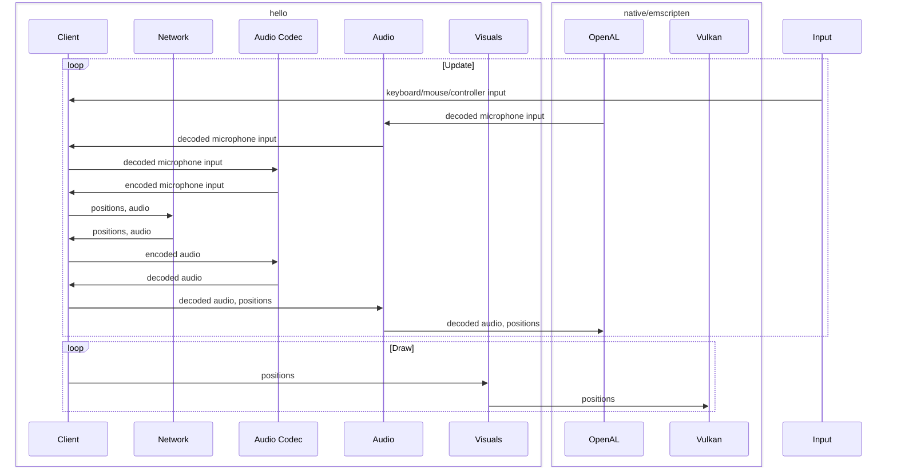

# Data Flow

## Current

## Questions

Audio Codec currently uses libopus directly. This is very slow in emscripten. Instead, the browser should use the browser's codec implementation. Should this be implemented using compiler-time polymorphism or a fixed number of coding buffers?

Network currently uses compile-time polymorphism to use boost on desktop and the browser's API in the browser. Instead, it could be implemented using a fixed number of connection slots with buffers for reading and writing. This would probably make testing easier.

Audio and Visuals use compile-time polymorphism. The alternative would probably be too complicated to implement, and the underlying implementation is already polymorph. 